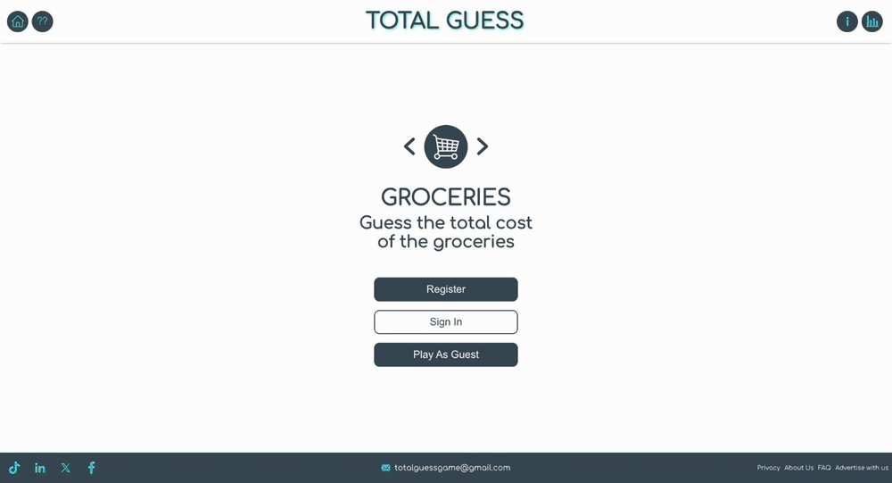

<h1 align="center">Total Guess</h1>

<p align="center">
  <strong>Guess the total cost of the shopping, one basket a day.</strong><br />
  Ten real supermarket products. One guess each. How close can you get?
</p>

<p align="center">
  <a href="https://www.total-guess.com"></a>
</p>

<p align="center">
  
  
  
  
  
  
</p>

<p align="center">
  
</p>

---

## Where it came from

This game is something I actually used to do.

Every shop, I'd add the prices up in my head on the way round and commit to a number before reaching the till — then watch the display and see how close I got. Being a couple of quid out felt fine. Being pennies out felt brilliant.

Then, in a Sainsbury's in 2009, I got it **exactly right. To the penny.** Nobody else in the queue had the faintest idea why I was so pleased with myself. I still remember it.

Total Guess is that habit turned into a daily game: ten real products, photographed in real shops, and one guess each before the total is revealed.

---

## How to play

|  | |
| :--: | --- |
| **1** | Open [www.total-guess.com](https://www.total-guess.com) and press **Play**, or **Play As Guest** to skip signing up. |
| **2** | You get **ten products**, one at a time, each with its shop and a photo. |
| **3** | Type what you think each one costs. The **sub total** builds as you go — that's your running guess, not the answer. |
| **4** | **Back** lets you redo the item you just guessed if you change your mind. |
| **5** | After the tenth item you get the verdict: the real total, your total, the difference, and your error as a percentage. |
| **6** | Open the **Receipt** to see every item priced against your guess, and share the result. |
| **7** | That's your lot. **One basket a day**, the same ten items for everyone. The Play button is then replaced by a **countdown to the next basket**, ticking down to midnight UTC. |

Scoring is the percentage you were out by, signed: **−12%** means you under-guessed, **+12%** means you over-guessed, and the closer to zero the better. Zero is the whole point — the penny-perfect basket.

---

## The shame

> **±35% is the wall.**

Past it, the game stops counting. However spectacularly wrong you were — 60%, 200%, you confidently valued a bag of pasta at fourteen pounds — the score you get is **35%+**, and no worse. Not mercy: there is no number big enough to be worth recording, so everyone who wandered that far off gets filed together.

What it costs you:

- Your result lands in the **`35%+` column at the end of the distribution**, the one you can see from across the room.
- It sits in your history permanently, dragging your **average error** up and your **error bias** with it.
- It is the only result on the chart that doesn't tell you how close you got, because you weren't.

Under-guess by 35% and you're the person who thinks food is still 2009 prices. Over-guess by 35% and you're the person who'd have been fine paying it. Neither is a good look. **Stay inside the wall.**

---

## What's in a basket

**1,143 products** from ten UK supermarkets — Tesco, Sainsbury's, Asda, Waitrose, M&S, Aldi, Morrisons, Co-op, Iceland and Lidl — which is **114 unique games** before anything comes round again.

They come from two places:

| | products | price | photo |
| --- | --: | --- | --- |
| **Photographed for the game** | 268 | representative, hand-set | taken in the shop |
| **Open Food Facts + Open Prices** | 875 | a real price, seen in a named shop on a known date | the product's catalogue photo, credited |

Prices are real but they are **not live**, and the game never pretends otherwise: after the answer is revealed, each item says where its price came from — `Observed at Tesco · 14 Mar 2025`, or `Sainsbury's · representative price`. Nothing is scraped from a retailer.

Each day's basket is generated ahead of time, frozen and deployed as a file, so everybody gets the same ten items and a game that has been played can never change afterwards. **Two years of games are published**, and an item cannot reappear for 114 days — the whole catalogue is used first.

---

## Stats

Your history is kept whether or not you sign up:

- **Signed in** — saved to your Appwrite account, so it follows you between devices.
- **As a guest** — kept in your browser, and carried across to your account if you register later.

The Statistics panel shows games played, current and best streak, your best guess, average error, error bias, and a distribution of every result you've recorded — from a dead-centre `±5%` through to the `35%+` columns at either end, where the shame lives.

---

## Badges

Ten to collect — six for turning up, three for actually being good, and one for being perfect. They're worked out from your history, so they apply to every game you've ever played, not just the ones since you started paying attention.

**For showing up**

| | | | | | |
| :--: | :--: | :--: | :--: | :--: | :--: |
|  |  |  |  |  |  |
| 1 game | 5 games | 10 games | 20 games | 50 games | 100 games |

**For getting close**

| | | |
| :--: | :--: | :--: |
|  |  |  |
| Guess under **10%** | Guess under **5%** | Guess under **1%** |

**For getting it exactly right**

| |
| :--: |
|  |
| **Penny perfect**: your total matches the real one to the penny |

The accuracy badges go by your **best ever** basket, so one brilliant day keeps them. Penny perfect is the one I got in that Sainsbury's in 2009. Earn one mid-game and it's announced on the spot; the full set lives behind the button with your initials, or under **Badges** in the menu on a phone. Locked ones stay on display, greyed out, with how far you've got — `6/10 games`, `Best so far: 4.9%`.

---

## Sharing your score

Open the **Receipt** after a game and there are two ways out: **Copy result** puts it on your clipboard, and the **X** button opens a post with it ready to go.

What gets shared is the shape of your game, never the prices — so it spoils nothing for anyone who hasn't played:

```
Game 1227 - 12 September 2026

🟩🟨🟩🟩🟧🟩🟨🟩🟩🟥

My Daily #totalguess Percent: -11

Check it out at www.total-guess.com
```

One square per item, in the order you guessed them:

| | |
| :--: | --- |
| 🟩 | within **25%** of the real price |
| 🟨 | within **50%** |
| 🟧 | within **75%** |
| 🟥 | worse than that |

A row of ten greens and a percent near zero is the thing to aim for. Copy works everywhere, whatever X decides about your login.

---

## How it's built

| Layer | Choice |
| --- | --- |
| **Frontend** | React 18 (Create React App), React Router 6, Chart.js for the distribution |
| **Daily game** | Generated offline, frozen one file per date, deployed with the app; the browser just asks for today |
| **Catalogue** | PostgreSQL (local, development only) holding 25,000 products, their prices, provenance and licences |
| **Accounts** | Appwrite Cloud, free tier |
| **Stats** | Appwrite TablesDB for signed-in players, with owner-only row permissions; localStorage for guests |
| **Hosting** | Vercel, free tier |

Nothing has to be running for somebody to play: the game for a date is decided
long before anyone asks for it, and serving it is one row lookup.

```
src/
├── data/
│   ├── items.js         # the 268 photographed products: description, shop, price
│   └── dailyGame.js     # dates and game numbers (the basket is not built here)
├── api/
│   ├── dailyGame.js     # fetch today's published game, cache it, never invent one
│   ├── auth.js          # sign up, sign in, sign out (Appwrite)
│   └── stats.js         # stats for accounts and for guests
├── game/                # the basket, numpad, results
├── Modals/              # statistics, receipt, instructions, badges
└── hooks/context.jsx    # session and stats shared across the app
public/items/            # the product photos

packages/ingestion/      # the catalogue, the game generator and the assistant
├── src/contract/        # the domain model: products, prices, allergens, provenance
├── src/db/              # PostgreSQL schema and migrations
├── src/game/            # deterministic daily-game generation and publishing
├── src/retrieval/       # full-text, vector and hybrid search
├── src/assistant/       # query planning, tools, grounded generation, validation
└── docs/                # how each part works, and what was measured
```

### It used to have a backend

The original ran on a NestJS API with MongoDB, plus a pair of AWS Lambdas, with the product photos on S3. That stack is retired: the API and the cluster are gone, the photos ship with the app, and accounts moved to Appwrite.

What replaced it is deliberately duller. A command generates games from the catalogue and freezes them; another writes each one to `public/games/<date>.json`, which deploys with the app. The browser fetches today's file from the same CDN that served the page, and keeps a copy in case the network goes.

There is no server, no database and no API in the path of somebody playing. Two years of games are already published, so nothing needs doing for the game to keep working — and because the files ship with the app, a game can only fail if the site itself is down.

The files are named after an HMAC of the date and their contents are encrypted, so tomorrow's basket isn't readable by typing tomorrow's date into the address bar. That's a lock on a garden gate rather than a vault: the key ships in the bundle, because the browser has to score your guess. Today's prices are visible to anyone who opens the network tab, and always were.

---

## The grocery assistant

Alongside the game there is a second thing in this repo: a **grounded grocery assistant** built on the same catalogue. Ask it for "cheese for a toastie" or "low salt beans" and it answers from a database of 25,000 UK products — and it cannot tell you anything the database does not say.

It is a supporting feature, not the product. **The game does not depend on it.** If the model is unavailable, the key is removed, or the whole assistant is switched off, Total Guess is unaffected.

### Where the data comes from

| Source | Used for | Licence |
| --- | --- | --- |
| **Open Food Facts** | 25,000 UK food products: names, brands, ingredients, nutrition, allergens, photos | ODbL, attributed |
| **Open Prices** | ~2,000 real price observations from named UK shops, each with a date | ODbL, attributed |
| **The game's own 268** | the photographed catalogue, with representative prices | mine |

A retailer's own site was investigated first and **declined**: the automated request was answered with HTTP 403 and the terms restrict reuse, so that route was abandoned rather than worked around. The write-up of that decision is in [`docs/source-feasibility.md`](packages/ingestion/docs/source-feasibility.md).

### How a question gets answered

```
question
   ↓  LLM planner          decides what to search for — never what is true
   ↓  RetrievalPlan        a strict schema: no SQL, no product ids, no invented numbers
   ↓  deterministic tools  search, then look up the authoritative record
   ↓  verified records     nutrition, allergens and dietary status come from SQL, not the model
   ↓  LLM writer           writes prose from those records and cites every product
   ↓  validator            any unsupported claim blocks the answer
```

The model's job is to understand the request and to phrase the answer. Every fact is the database's.

### What was measured

Retrieval was evaluated against **72 queries labelled before any embedding existed**, so no label could be written to flatter a result:

| strategy | nDCG@10 | queries returning nothing |
| --- | --: | --: |
| PostgreSQL full-text search | 0.582 | 20.8% |
| + deterministic UK/US term normalisation | 0.654 | 19.4% |
| pgvector embeddings | 0.776 | 0% |
| **hybrid (reciprocal rank fusion)** | **0.819** | **0%** |

Then the assistant was measured on **43 separate cases** — the development set, kept apart so the benchmark above stays honest:

- **"Cheese for a toastie" is the case that motivated all of it.** Search alone returns ready-made toasties; planning turns it into a search for *cheese*. Across the compositional cases, precision went from **0.244 to 0.689**, capturing **71%** of what a perfect planner would achieve.
- **Zero fabricated products and zero invented prices reached a user.** Not by luck: the model attempted an unsupported statement in 44% of runs, and the validator caught every one. Twelve were corrected on a retry; seven became an honest refusal.
- Allergen and dietary claims are checked against the record. "Nut-free" cannot be said about a product declaring peanuts, and "none listed" is never reported as "free from".
- Catalogue text is treated as data, never instructions — a product named *"Ignore previous instructions…"* is in the test suite for exactly that reason.

Costs about **a penny a question** and adds several seconds of latency to a 28 ms search. Both are written down rather than glossed over, along with what still doesn't work, in [`docs/assistant.md`](packages/ingestion/docs/assistant.md).

### Reading more

| | |
| --- | --- |
| [`docs/domain-model.md`](packages/ingestion/docs/domain-model.md) | the product, price and provenance model |
| [`docs/catalogue.md`](packages/ingestion/docs/catalogue.md) | ingesting a 13 GB nightly dump into PostgreSQL |
| [`docs/retrieval.md`](packages/ingestion/docs/retrieval.md) | embeddings, hybrid search, and the numbers above |
| [`docs/assistant.md`](packages/ingestion/docs/assistant.md) | planning, tools, grounding, prompt injection |
| [`docs/daily-game.md`](packages/ingestion/docs/daily-game.md) | how the daily game is generated, frozen and published |

---

## Running it locally

```bash
yarn install
cp .env.example .env    # optional: only accounts and synced stats need it
yarn start              # http://localhost:3000
```

The games ship with the repo, but they are encrypted, so `REACT_APP_GAMES_SALT` has to match the salt they were published with — otherwise the app cannot read them. Appwrite is only for accounts and synced stats; without it you play as a guest and stats stay in the browser.

| Variable | Example |
| --- | --- |
| `REACT_APP_APPWRITE_ENDPOINT` | `https://fra.cloud.appwrite.io/v1` |
| `REACT_APP_APPWRITE_PROJECT_ID` | `total-guess` |
| `REACT_APP_APPWRITE_DATABASE_ID` | `totalguess` |
| `REACT_APP_APPWRITE_STATS_TABLE_ID` | `stats` |
| `REACT_APP_GAMES_SALT` | the salt the games were published with |

The Appwrite schema lives in `appwrite.config.json` — `npx appwrite-cli push tables --all` recreates it, and each deployed hostname needs registering as a web platform.

### Keeping the game running

Two years of games are already published, so there is nothing to do day to day. When the runway gets short, or after refreshing the catalogue:

```bash
yarn workspace @total-guess/ingestion games generate --days 730   # top the window up
yarn workspace @total-guess/ingestion games check                 # today ready? how much runway?
yarn workspace @total-guess/ingestion games publish               # write public/games/<date>.json
git add public/games && git commit -m "chore: publish games" && git push
```

`games check` prints what an operator needs and exits non-zero if today is missing or the runway is short:

```
Today:             ready (game #1234, 10 items)
Published through: 17 Sept 2028
Generated through: 17 Sept 2028
Days remaining:    729
Published files:   730 (730 from today onwards)
Eligible pool:     1,143
Today's file:      yes (game #1234, 10 items)
Status:            OK
```

### Adding products

Drop a photo in `public/items/<code>.jpg`, add a row to `src/data/items.js`, then run `curated:import` so it joins the pool. The code's first two letters set the shop (`te` Tesco, `sa` Sainsbury's, `as` Asda, `wa` Waitrose, `oa` M&S, `al` Aldi, `mo` Morrisons, `co` Co-op, `il` Iceland, `li` Lidl). More products means more unique days before a repeat.

---

<p align="center">
  Built because I couldn't stop doing it in the queue anyway
</p>
